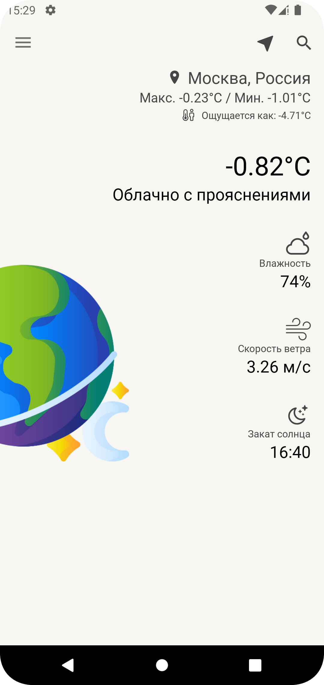
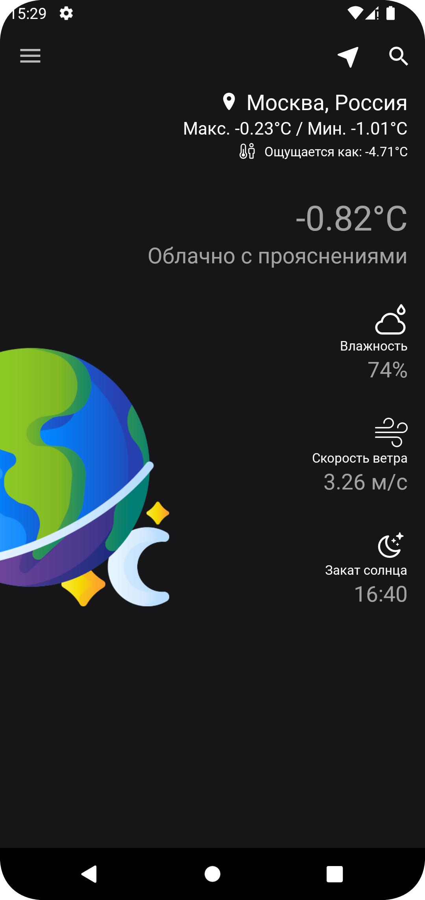
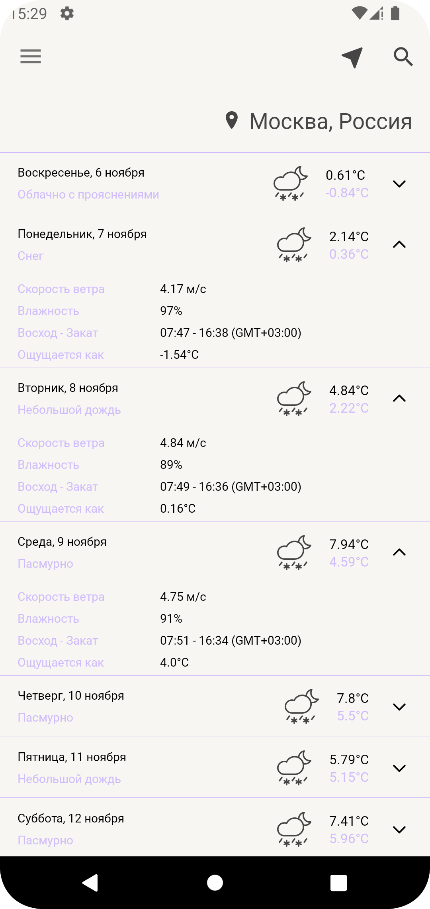
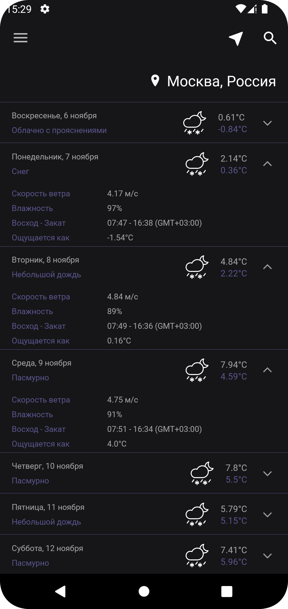
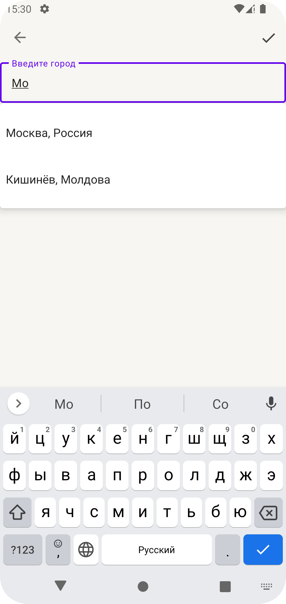
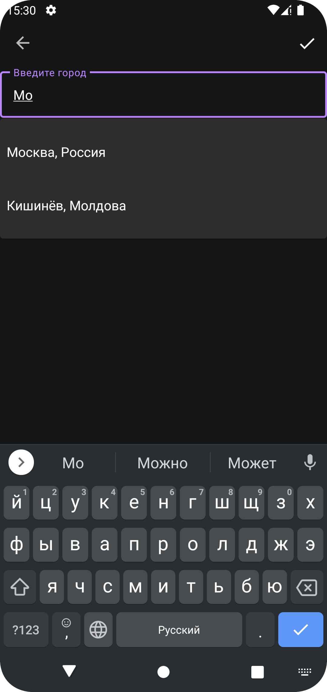

# Погодное приложение для Avito

Следующие технологии были использованы(реализованы) в приложении:
- MVVM
- Реализованы светлая и темная темы
- Dagger2 DI
- Retrofit
- Coroutines
- NavComponent

## Демонстрация проделанной работы:

| Светлая тема | Темная тема |
| :---: | :---: |
|  |  |
|  |  |
|  |  |
|  |  |